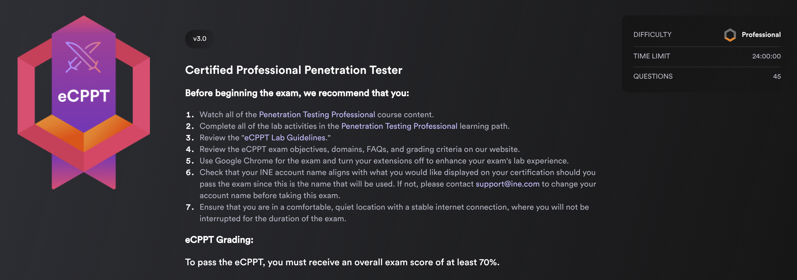

# 📝 eCPPTv2 and v3 / PTP - Notes

<figure><figcaption></figcaption></figure>

## 📕 eCPPT - Version 3 (newest - after 2024) 

### Course duration & Topics ⏳📚 

\~ 107 hours (_`~97 of videos`_) **10** courses , **172** videos, **124** quizzes, **67** labs

* [**Resource Development & Initial Access**](readme/ecpptv3/powershell-for-pt/) \~ 22 hours
* [**Web Application Attacks** ](readme/ecpptv3/web-app-security/)\~ 14 hours
* [**Network Security**](readme/ecpptv3/network-security/) \~ 17 hours
* [**Exploit Development** ](readme/ecpptv3/system-security/)\~ 7 hours
* [**Post Exploitation**](readme/ecpptv3/linux-exploitation/) \~ 18 hours
* [**Red Teaming**](readme/ecpptv3/wi-fi-security/) \~ 19 hours

🛣️ [**RoadMap / Exam Preparation** ](roadmap-and-my-experience.md)🧑🏻‍🏫

### E-Links 🔗📔 

* Where to find the eCPPTv3 certification exam? - [eCPPTv3](https://security.ine.com/certifications/ecppt-certification/)
* Where to find the PTPv3 (Professional Penetration Testing v3) course [INE Learning Paths​](https://my.ine.com/CyberSecurity/learning-paths/5e26d0ba-d258-49e0-a421-56cc06626f46/penetration-testing-professional-new-2024)

​​[eCPPT](https://security.ine.com/certifications/ecppt-certification/) Exam 📄🖊️

<figure><figcaption></figcaption></figure>

* **Time limit**: 24h
* **Expiration date**: yes
*   **Objectives**:

    **Information Gathering & Reconnaissance** (10%)

    * Perform Host Discovery and Port Scanning on Target Networks
    * Enumerate Information From Services Running on Open Ports

    **Initial Access** (15%)

    * Perform Username Enumeration to Identify Valid User Accounts on Target Systems
    * Perform Password Spraying Attacks to Identify Valid Credentials for Initial Access
    * Perform Brute-Force Attacks on Remote Access Services for Initial Access

    **Web Application Penetration Testing** (15%)

    * Perform Web Application Enumeration to Identify Potential Vulnerabilities & Misconfigurations
    * Identify and Exploit Common Web Application Vulnerabilities For Initial Access (SQLi, XSS, Command Injection, etc)
    * Perform Brute-Force Attacks Against Login Forms
    * Exploit Vulnerable and Outdated Web Application Components
    * Exfiltrate Data and Credentials From Compromised Web Applications and Databases

    **Exploitation & Post-Exploitation** (25%)

    * Identify and Exploit Vulnerabilities or Misconfigurations in Services
    * Identify and Exploit Privilege Escalation Vulnerabilities
    * Dump and Crack Password Hashes
    * Identify Locally Stored Unsecured Credentials

    **Exploit Development** (5%)

    * Develop/Modify Exploit Code For Initial Access and Post-Exploitation
    * Identify and Exploit Memory Corruption Vulnerabilities (Stack Overflow, Buffer Overflow)

    **Active Directory Penetration Testing** (30%)

    * Perform Active Directory Enumeration
    * Identify Domain Accounts With Weak or Empty Passwords
    * Perform AS-REP Roasting to Steal Kerberos Tickets for Authentication
    * Perform Active Directory Lateral Movement Techniques (Pass-the-Hash, Pass-the-Ticket)
    * Obtain Domain Admin Privileges/Access

## Resources 📑📘

### 👉 [eCPPT/PTP Cheat Sheet ](ecppt-cheat-sheet.md)📔

> 📖 [Read the Lab Guidelines](https://drive.google.com/file/d/1kgS7gerK5V5yJxOutb12IPMO1-FLf3Yw/view?usp=drive_link) <mark style="color:yellow;">📖</mark>

***

<figure><figcaption>
<a href="https://security.ine.com/certifications/ecppt-certification/">https://security.ine.com/certifications/ecppt-certification/</a>
</figcaption></figure>

## 📙 eCPPT - Version 2 (until 2024) 

### Course duration & Topics ⏳📚 

\~ 84 hours (_`~56h of videos`_) **8** courses , **85** videos, **83** quizzes, **27** labs

* **​**[**System Security**](readme/readme/system-security/) \~ 13 hours
* [**Network Security**](readme/readme/network-security/) \~ 33 hours
* [**PowerShell for Pentesters**](readme/readme/powershell-for-pt/) \~ 6 hours
* **​**[**Linux Exploitation**](readme/readme/linux-exploitation/) \~ 9 hours
* [**​Web App Security**](readme/readme/web-app-security/) \~ 10 hours
* **​**[**Wi-Fi Security**](readme/readme/wi-fi-security/) \~ 6 hours
* **​**[**Metasploit & Ruby**](readme/readme/metasploit-and-ruby/) \~ 8 hours

🛣️ [**RoadMap / Exam Preparation** ](roadmap-and-my-experience.md)🧑🏻‍🏫

### E-Links 🔗📔 

* Where to find the PTPv2 (Professional Penetration Testing v2) course? - [INE Learning Paths](https://security.ine.com/certifications/ecppt-certification/)​
* Where to find the eCPPTv2 certification exam? - [eCPPTv2](https://security.ine.com/certifications/ecppt-certification/)​

### ​[eCPPT](https://security.ine.com/certifications/ecppt-certification/) Exam 📄🖊️ 

* **Time limit**: 7 days + 7 days for report
* **Expiration date**: no
* **Objectives**:
  * Penetration testing processes and methodologies, against Windows and Linux targets
  * Vulnerability Assessment of Networks
  * Vulnerability Assessment of Web Applications
  * Advanced Exploitation with Metasploit
  * Performing Attacks in Pivoting
  * Web application Manual exploitation
  * Information Gathering and Reconnaissance
  * Scanning and Profiling the target
  * Privilege escalation and Persistence
  * Exploit Development
  * Advanced Reporting skills and Remediation

## Resources 📑📘

### 👉 [eCPPT/PTP Cheat Sheet ](ecppt-cheat-sheet.md)📔

> 📖 [Read the Lab Guidelines](https://assets.ine.com/certifications/exam-guides/eCPPTv2_PRE_EXAM.pdf) <mark style="color:yellow;">📖</mark>

***

## Other Resources 📑📘

### [👉 Preparation RoadMap to pass eCPPT/PTP exam 🛣️](roadmap-and-my-experience.md)

### 👉 [Exam Experience](https://medium.com/@dev-angelist/learning-path-my-experience-for-the-eccptv2-ptp-certification-april-2024-15ddf6b29a8f) (v2) 💯&#x20;
